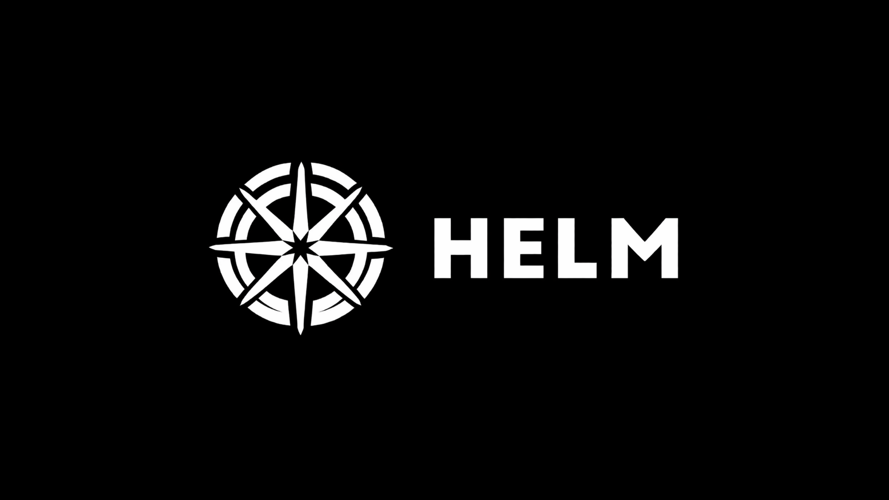
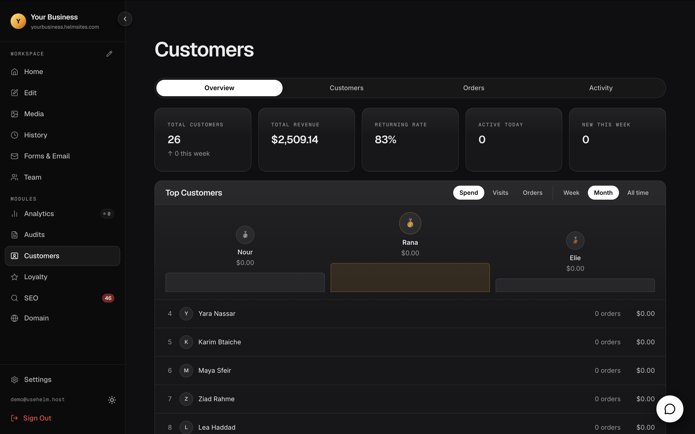
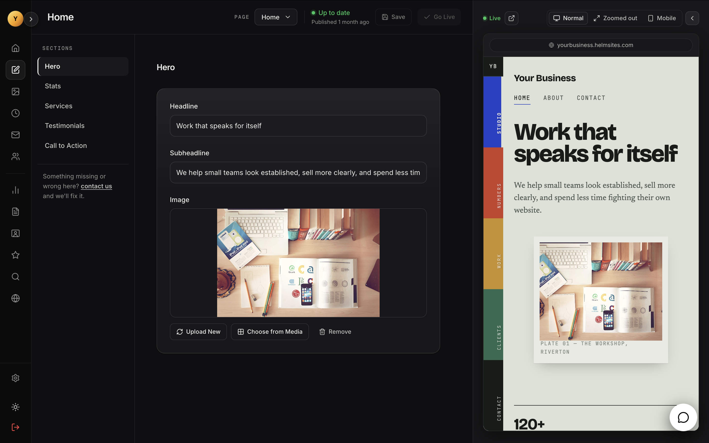
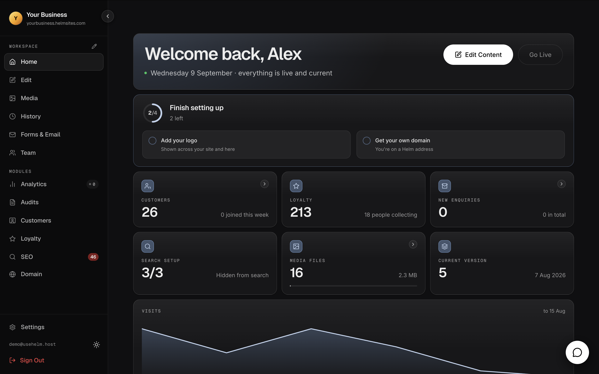
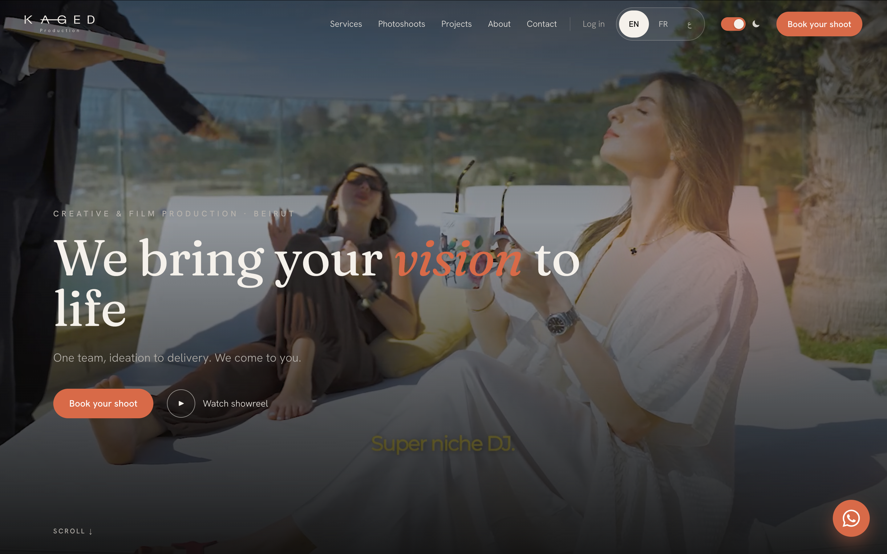

<!--
HELM ORGANIZATION PROFILE
Repository: Helm-Business-Platform/.github
Destination: profile/README.md

IMAGE SETUP
Create: profile/assets/
The screenshot slots below are intentionally commented out so the page remains
clean until the final images are uploaded. Search for "SCREENSHOT SLOT".
-->

<picture>
  <source media="(prefers-color-scheme: dark)" srcset="./assets/helm-wordmark-dark.png">
  
</picture>

### Your website and business, in one dashboard.

One secure platform for building, managing and understanding a business online.

 

  

<a href="https://changelog.usehelm.host">Changelog</a>
&nbsp;&nbsp;•&nbsp;&nbsp;
<a href="https://status.usehelm.host">System status</a>
&nbsp;&nbsp;•&nbsp;&nbsp;
<a href="https://usehelm.host/blog">Journal</a>
&nbsp;&nbsp;•&nbsp;&nbsp;
<a href="https://usehelm.host/partners">Partners</a>
&nbsp;&nbsp;•&nbsp;&nbsp;
<a href="mailto:contact@usehelm.host">Contact</a>

---

## One connected business platform

Helm brings a business website, customer data and everyday operations together in one branded dashboard. Instead of stitching together separate tools and subscriptions, businesses work from one connected system built around their needs.

Content, media, analytics, SEO, customer accounts, bookings, loyalty, orders, courses and other workflows can share the same records—giving owners a clearer view of their business and customers a more consistent experience.

  

 

<table>
  <tr>
    <td width="50%" valign="top">
      <h3>◈ Website & content</h3>
      
Update pages, publish content, manage media and keep the business website current without depending on disconnected tools.

    </td>
    <td width="50%" valign="top">
      <h3>◎ Customers & operations</h3>
      
Bring customer accounts, bookings, loyalty, orders, courses and business-specific workflows into the same branded experience.

    </td>
  </tr>
  <tr>
    <td width="50%" valign="top">
      <h3>⌁ Analytics & SEO</h3>
      
Understand performance, monitor search visibility and act on useful business data from the same place used to manage the website.

    </td>
    <td width="50%" valign="top">
      <h3>◇ Connected modules</h3>
      
Choose from 23 modules designed around real business needs. Each module connects to the wider Helm system instead of becoming another isolated subscription.

    </td>
  </tr>
</table>

## Start your way

<table>
  <tr>
    <td width="33%" valign="top" align="center">
      <h3>Build with Helm AI</h3>
      
Start shaping a business website through a guided AI experience.

      
<a href="https://ai.usehelm.host"><strong>Open Helm AI →</strong></a>

    </td>
    <td width="33%" valign="top" align="center">
      <h3>Work with our team</h3>
      
Launch a custom website and configure the right modules with direct support.

      
<a href="https://usehelm.host"><strong>Explore Helm →</strong></a>

    </td>
    <td width="33%" valign="top" align="center">
      <h3>Connect an existing site</h3>
      
Bring an existing website into Helm and add connected capabilities over time.

      
<a href="mailto:contact@usehelm.host"><strong>Talk to Helm →</strong></a>

    </td>
  </tr>
</table>

<table>
  <tr>
    <td width="50%"></td>
    <td width="50%"></td>
  </tr>
</table>

## Built for businesses—not just websites

Helm is designed for small and growing businesses that want control without carrying the technical burden themselves. A business can begin with the website and expand into the operational modules it genuinely needs.

- **One branded experience** across the website, dashboard and customer-facing workflows
- **English and Arabic experiences** for businesses serving multilingual audiences
- **Direct, ongoing support** from people who understand the platform
- **Flexible delivery** through Helm AI, the Helm team or an existing website
- **Clear expansion path** as the business, team and customer base grow

  

## Explore Helm

<table>
  <tr>
    <td width="33%" valign="top">
      <h3>▣ Product</h3>
      
<a href="https://usehelm.host"><strong>Platform overview</strong></a> See what Helm brings together.

      
<a href="https://ai.usehelm.host"><strong>Helm AI</strong></a> Start creating with AI.

    </td>
    <td width="33%" valign="top">
      <h3>▤ Resources</h3>
      
<a href="https://docs.usehelm.host"><strong>Documentation</strong></a> Understand the platform.

      
<a href="https://usehelm.host/blog"><strong>Journal</strong></a> Ideas, guides and updates.

    </td>
    <td width="33%" valign="top">
      <h3>◉ Company</h3>
      
<a href="https://usehelm.host/partners"><strong>Partners</strong></a> Grow and deliver with Helm.

      
<a href="mailto:contact@usehelm.host"><strong>Contact</strong></a> Speak directly with the team.

    </td>
  </tr>
</table>

## Open, reliable and continuously improving

  
  
  

Product improvements are published through the <a href="https://changelog.usehelm.host">Helm changelog</a>, platform availability is reported on the <a href="https://status.usehelm.host">public status page</a>, and product guidance lives in the <a href="https://docs.usehelm.host">documentation</a>.

## Find Helm elsewhere

  
  

<!-- SOCIAL LINKS SLOT
Add official social badges here once you have confirmed the final public URLs.
Recommended: LinkedIn first, followed by Instagram, YouTube and X.
Do not publish placeholder URLs.
-->

---

### Take command of your business online.

<a href="https://usehelm.host"><strong>Visit Helm</strong></a>
&nbsp;&nbsp;•&nbsp;&nbsp;
<a href="mailto:contact@usehelm.host"><strong>contact@usehelm.host</strong></a>

  

Helm S.A.R.L. · Beirut, Lebanon

